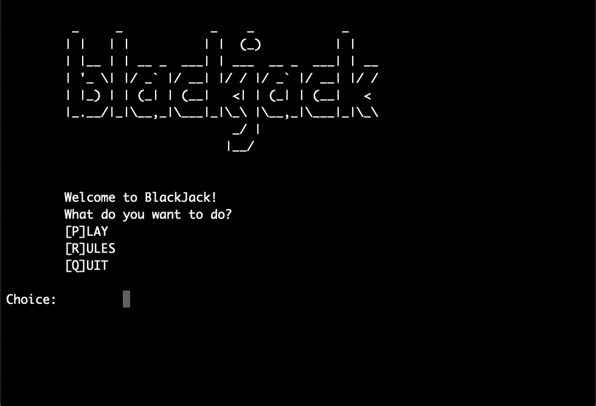
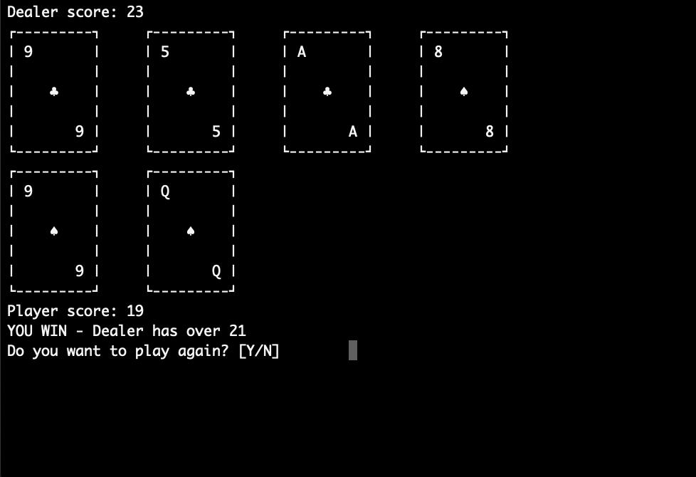

# Visual Blackjack in terminal

Just a small script to play Blackjack against a dealer on the terminal. 

No extra dependencies are required. 

#♥ ️ ♦ ️RULES ♣ ️♠ 

    -The object of the game is to create card totals higher than those of the dealer's hand 
    but not exceeding 21, or by stopping at a total in the hope that dealer will bust.
    
    -Number cards count as their numbers.
    -Jack, Queen and King count as 10.
    -Aces count as 1 or 11, acording to the players choice.
    
    -After the player hits STAND the dealer's hand is resolved by 
    drawing cards until the hand achieves a total of 17 or higher.
    
    -A player total of 21 on the first two cards is called Blackjack and the players wins
    immediatelly unless dealer has also one.